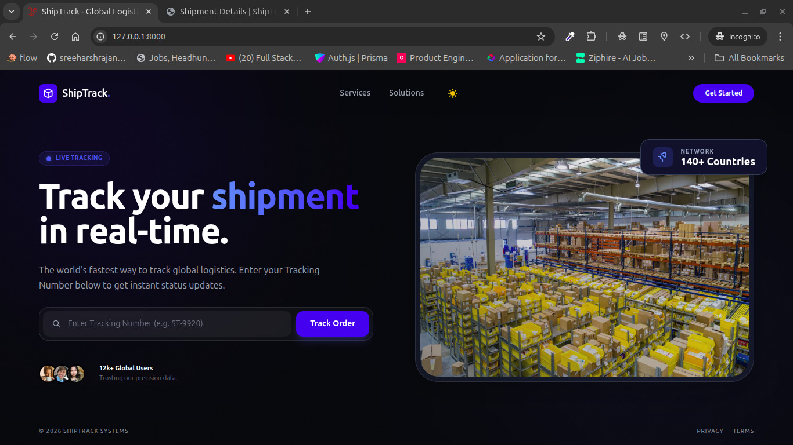

# Shipment Tracking Application

A simple Shipment Tracking Web Application built using Laravel 12 and PHP 8.2.
This project allows users to view shipments, track their current status, and see shipment history with a clean, server-rendered interface.



## Features

- Authentication
- Shipment Tracking using Tracking Number
- View all Shipments with Pagination
- Shipment details page


## Tech Stack

- PHP ^8.2
- Laravel Framework ^12.0
- MySQL 
- Blade Templates with SSR
- Tailwind CSS

## Installation & Setup

1. Clone the Repository

```bash
git clone https://github.com/your-username/shipment-tracker.git
cd shipment-tracker
```

2. Install Dependencies

```bash
composer install
npm install
```
3. Environment Setup

```bash
cp .env.example .env
php artisan key:generate
```

4. Run Migrations

```bash
php artisan migrate
```
5. Run project in development

```bash
composer dev
```

## Project Demo


## License

This project is open-sourced under the MIT License.

## Author

[Sreeharsh Rajan](https://sreeharsh.vercel.app/)
- Full Stack Developer